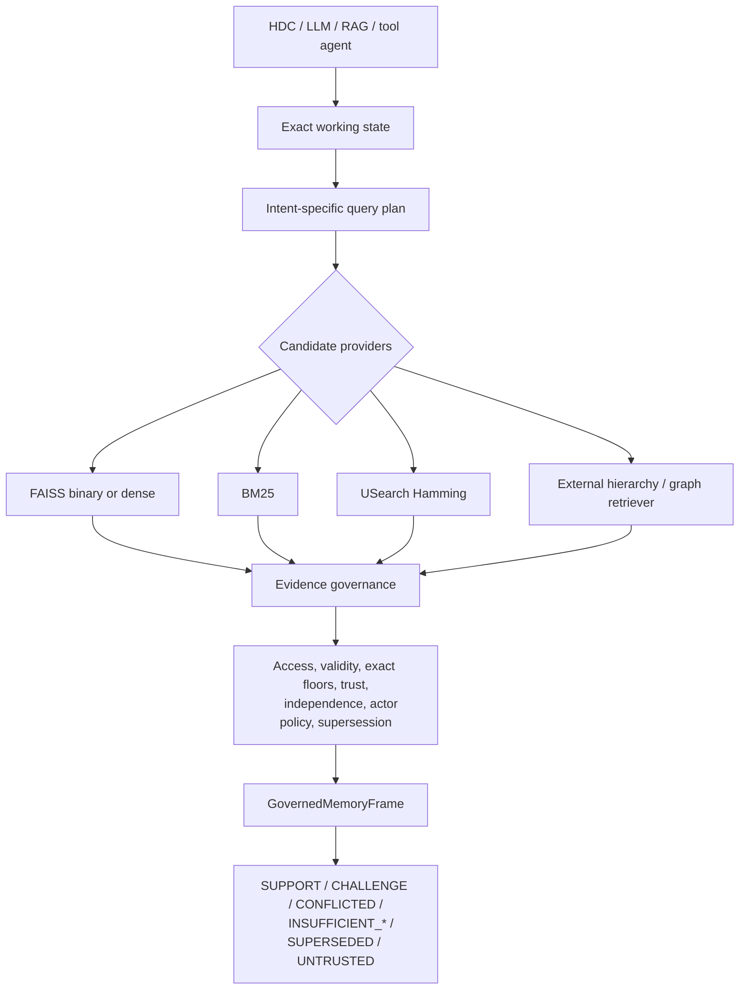
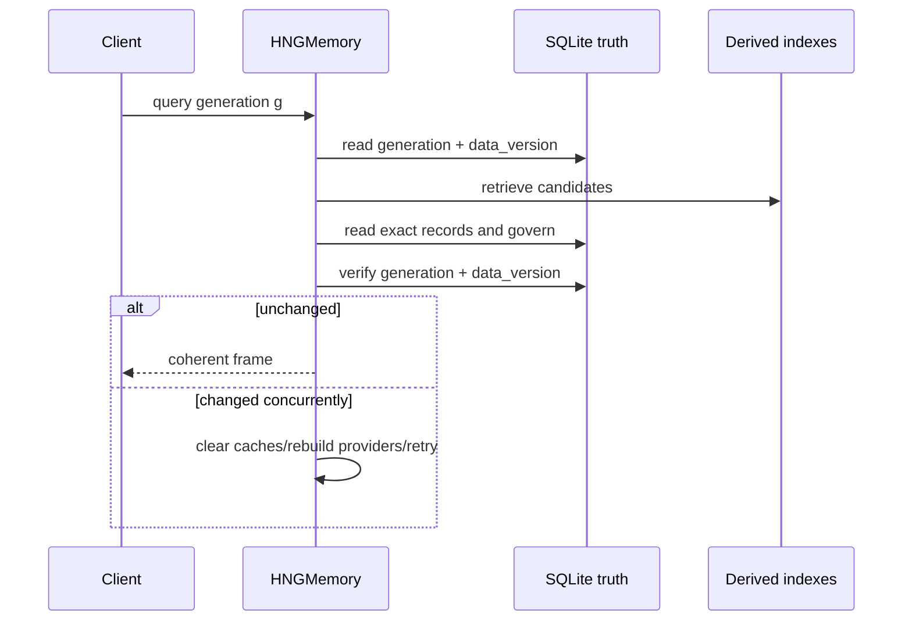
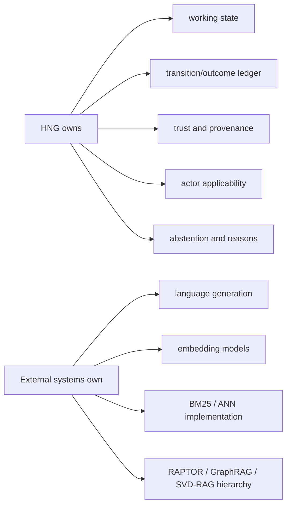

# HNG Frontier 0.7 architecture

HNG is an evidence-governed memory and control layer. SQLite records and deterministic working state are authoritative; retrieval indexes are replaceable derived state.

## Persistence and coherent queries

Writes commit evidence before advancing the generation. A process killed before commit leaves no record. A process killed after commit may lose derived index state, but reopen or generation mismatch rebuilds it from SQLite. Raw evidence is never deleted by consolidation.

## Integration boundary

The automatic binary provider remains Flat below 50K and IVF above it. MultiHash and USearch are explicit modes: MultiHash is extremely fast on independent vectors but measured at 25.07 ms p50 on correlated leading-bit geometry versus IVF at 0.60 ms; USearch had weaker recall/build behavior on the evaluated HDC distribution.

